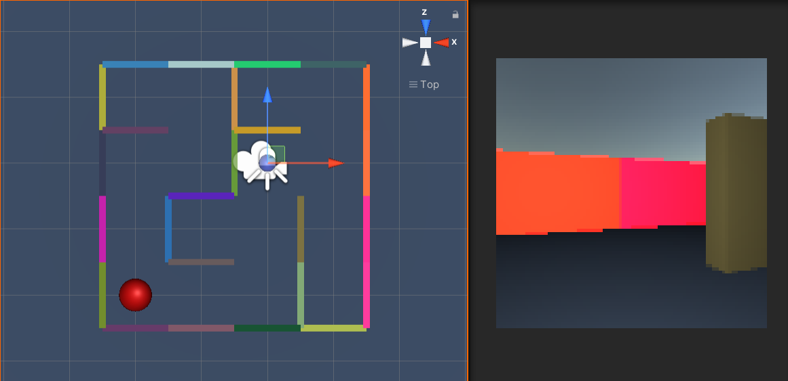

# Maze-env-gym-mlagent

Made using mlagent with openai gym style

Unity side of the code can be found here https://github.com/LimePencil/Unity_env_for_gym

torch version 1.7.1
gym-unity version 0.27.0
mlagents version 0.27.0
cudann 11.3